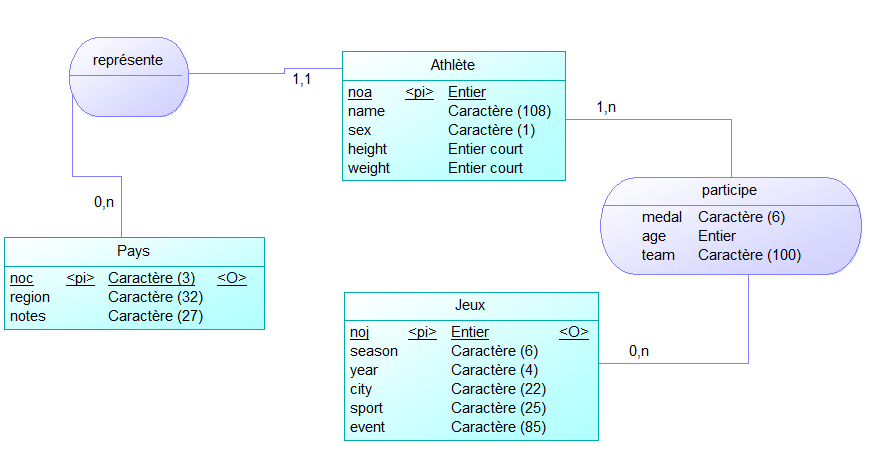

<br><br><br><br><br><br><br><br><br><br><br><br>


<center>
    <h1><b>Rapport BDD</b></h1>
    <h2>Jeux Olympiques</h2>
<br><br>
<h2>Nicolas ECKMAN et Aymeri TOURNEUR</h2></center>
<br><br><br><br><br><br><br><br><br>

## **Exercice 1**
### **1. Combien y-a t-il de lignes dans chaque fichier ?**

```bash
cat athlete_events.csv | wc -l
```
### **2. Afficher uniquement la première ligne du fichier athlète**
```bash
cat athelete_events.csv | head -1
```

La première ligne est:
```
"ID","Name","Sex","Age","Height","Weight","Team","NOC","Games","Year","Season","City","Sport","Event","Medal"
```

### **3. Quel est le séparateur de champs ?**

- À partir de maintenant, on utilisera une version légerement modifiée du fichier noc_regions.csv en remplaçant les carriage return Windows par des retours à la ligne Linux et en nommant le fichier "vnoc_regions.csv" a l'aide de la commande: 
```bash
cat noc_regions.csv | tr "\r\n" "\n" >vnoc_regions.csv 
```

### 4. **Que représente une ligne ?**
- Pour le fichier *athlete_events.csv*, une ligne représente un athlète, avec ses informations principales comme son nom, son âge, sa taille, les médailles qu'ils a remporté(e) durant sa carrière, etc...

- Pour *vnoc_regions.csv* une ligne remporte le code du pays (diminutif) ainsi que son nom entier. Il y a aussie une partie, de base vide, qui permet de préciser de quel pays exact il s'agit. 

### **5. Combien y-a t-il de colonnes ?**
- Pour vnoc_regions.csv:
```bash
cat noc_regions.csv | head -1 | tr "," "\n" | wc -l 
```

- Pour athlete_events.csv:
```bash
cat athlete_events.csv | head -1 | tr "," "\n" | wc -l 
```

### **6. Quelle colonne distingue les jeux d’été et d’hivers ?**
```bash
cat ahlete_events.csv | head -1 | tr "," "\n" | nl | grep Games
```
Nous pouvons observer que la colonne 9 est la colonne distinguant les jeux d'été et d'hivers


### **7. Combien de lignes font référence à Jean-Claude Killy ?**
```bash
cat ahlete_events.csv | grep "Jean-Claude Killy" | nl
```
Cette commande nous affiche les 6 lignes mentionnant Jean-Claude Killy


### **8. Quel encodage est utilisé pour ce fichier ?**
```bash
file -bi athlete_events.csv
```


### **9. Comment envisagez vous l’import de ces données ?**
Nous envisageaons un import a l'aide de la commande 
```sql
COPY FROM
```
qui permet de copier d'un fichier vers une table.

## Exercice 2

### **1. Créer une table import permettant l’importation de ces données**
```sql
\i importation.sql 
```

### **2. Remplir cette table avec les données récupérées**
```sql
\copy import FROM 'athlete_events.csv' WITH (FORMAT CSV, HEADER true, NULL 'NA');
```

### **3. Supprimez toutes les données strictement inférieures à 1920**
```sql
DELETE FROM import WHERE year < 1920;
DELETE FROM import WHERE sport = 'Art Competitions';
SELECT COUNT(*) FROM import;
```
renvoie 255080

### **4. Importer tel quel le fichier noc_regions.csv**
```sql
co
```

## **Exercice 3**
Voir le fichier ``requetes.sql``.


## **Exercice 4**
### **1. Fournir le MCD associé.**



### **2. Fournir le MDL associé.**
Pays(<u>noc</u>, region, notes)
Jeux(<u>noj</u>, season, year, city, sport, event, #noc)
Athlète(<u>noa</u>, name, sex, height, weight)
Participe(<u>#noa, #noj</u>, medal, age, team)


- Ajouter dans la table Pays

```sql
INSERT INTO pays SELECT * FROM noc_regions;
```

- Ajouter dans la table Jeux

```sql
INSERT INTO jeux(season, city) SELECT DISTINCT season, city FROM athlete_events;
```
### **2. Une question de taille !**
<ol>
    <li>Le fichier <code>athlete_events.csv</code> fait <b>41,5Mo</b>, et le fichier <code>noc_regions.csv</code> en fait <b>3,6Ko.</b></li>
    <li>On peut avoir la taille du fichier avec la commande: <code>SELECT pg_size_pretty (pg_total_relation_size('import'));</code>. La table import fait <b>46Mo</b>.</li>
</ol>

## **Exercice 5**
> Toutes les requêtes sont dans le fichier ``requetes.sql``

## **Exercice 6**


<h1><center><b>Allemagne</b></center></h1>

> Nous avons choisis le pays Allemagne. Le sport que nous avons pris est la boxe.

Requête n°1 - Le nombre de médaille d'or de l'Allemagne dans le boxe.

Requête n°2 - La ville et le pays où le plus de médaille ont été gagnée par des allemand(e)s dans le sport de boxe.

Requête n°3 - Les 3 personnes ayant le plus participé(e) aux épreuves de boxe.

Requête n°4 - La taille et l'âge moyen des personnes allemandes ayant gagné(e) une médaille(s) dans le sport de boxe.